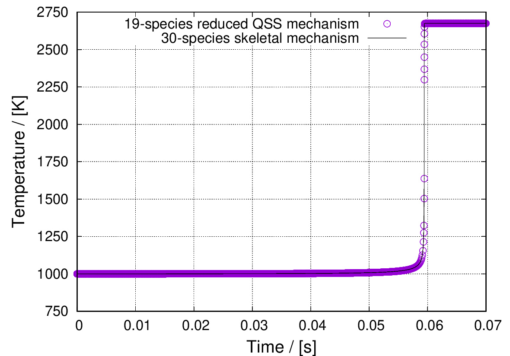

# QSSAchemistrySolver
The quasi-steady-state approximation chemistry solver for OpenFOAM 4 and 7

> This repository is migrated from [adhiraj-dasgupta/unsupportedContribOF23x](https://github.com/adhiraj-dasgupta/unsupportedContribOF23x). For OpenFOAM-2.3, please refer to that repository.


## compile the code and test it
- chose a branch to download. This repository works for OpenFOAM-4.x (master branch) and OpenFOAM-7 (of7 branch).
- come into the `CODE` folder and `wmake` to compile
```shell
    git clone git@github.com:ZmengXu/QSSAchemistrySolver.git
    cd CODE
    wmake
```
- come into the `CASE` folder and run the demo case
```shell
    cd CASE
    chmod 777 Allrun Allclean
    ./Allrun
```

## run QSS in your own case
Here is the instructions for your own case:
- In $FOAM_CASE/system/controlDict, compile to get a QSS mechanism library,
   in shell typing the following command to compile mechanism

```shell
    gfortran -shared -fPIC -o libMechnism19sCH4.so ckwyp.f
```

- In $FOAM_CASE/system/controlDict
```C++
    libs
    (
        "./chemkin/libMechnism19sCH4.so"
        "libQSSchemistryModel.so"
    );
```
- In $FOAM_CASE/constant/chemistryProperties
```C++
    chemistryType
    {
        chemistrySolver QSS;
        chemistryThermo psi;
    }
    QSSCoeffs
    {
        solver          seulex;
        absTol          1e-12;
        relTol          0.1;
    }
```
Here's the temperature trace results for 19 species QSS and 30 species mechanism.


